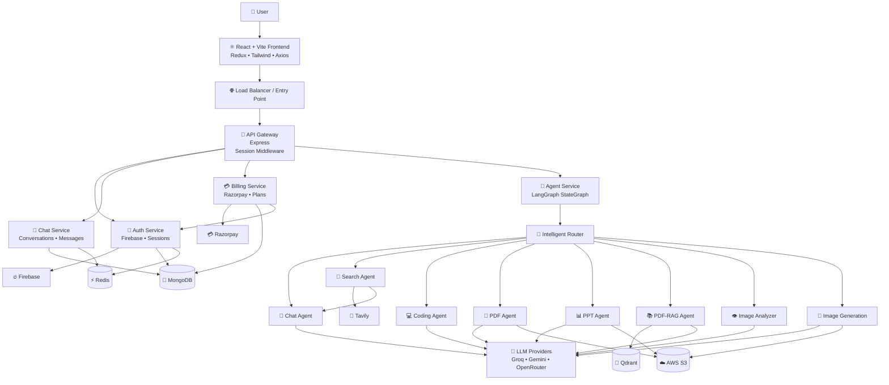
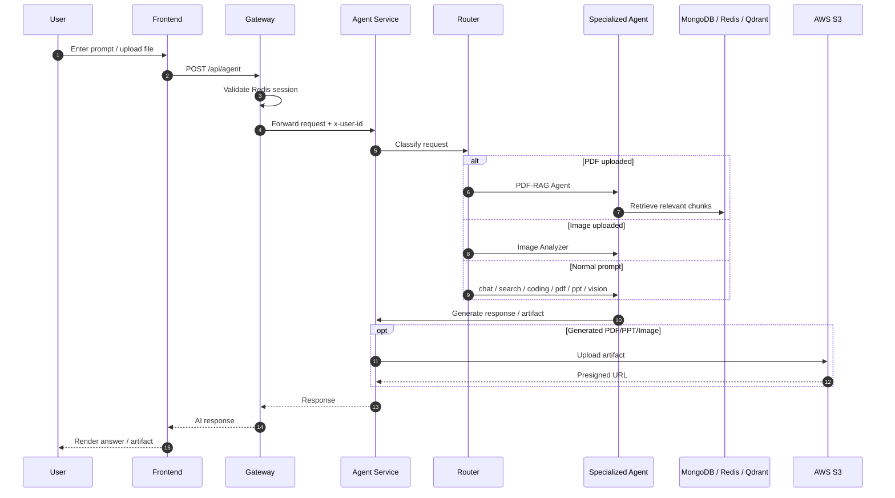
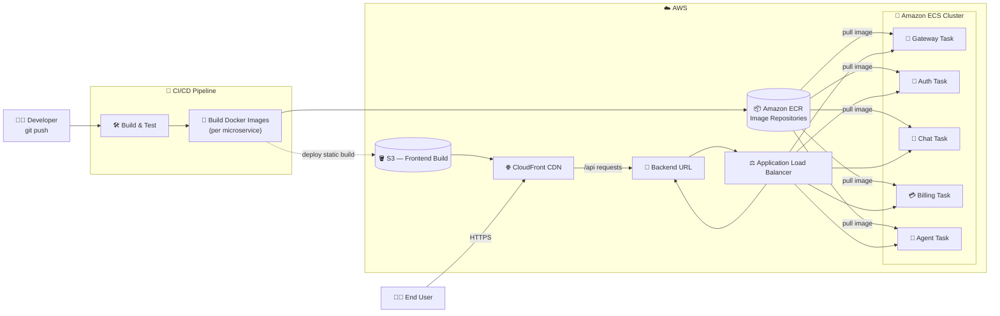
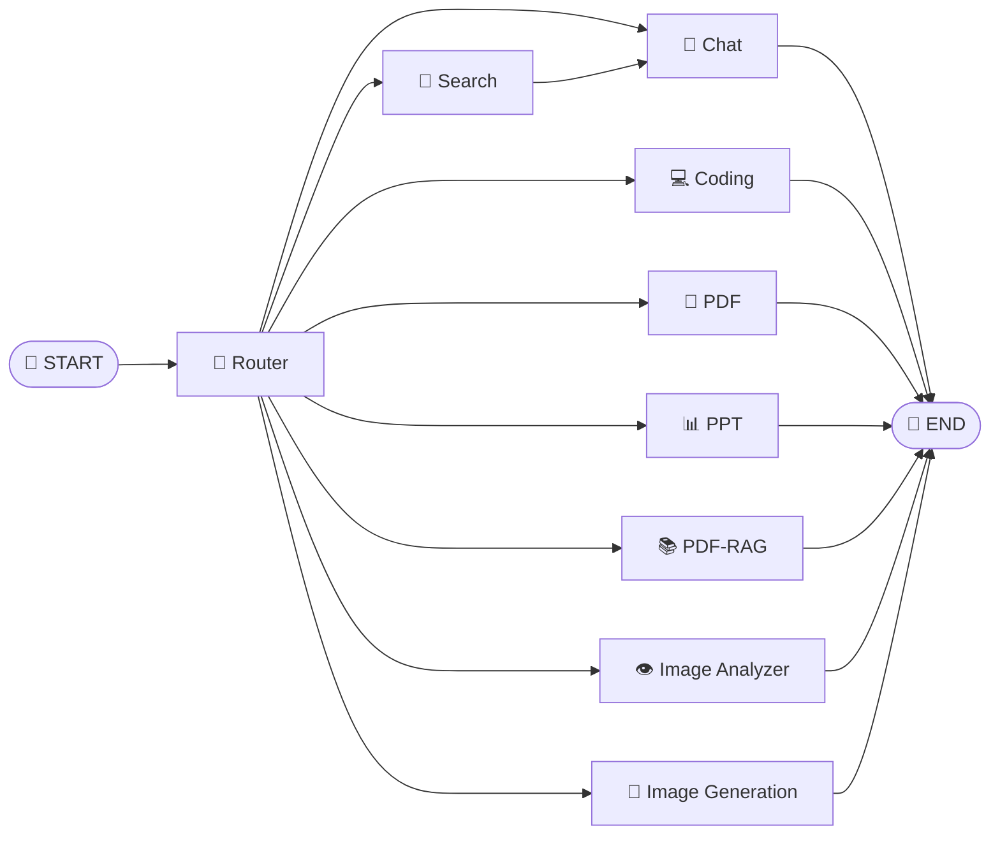
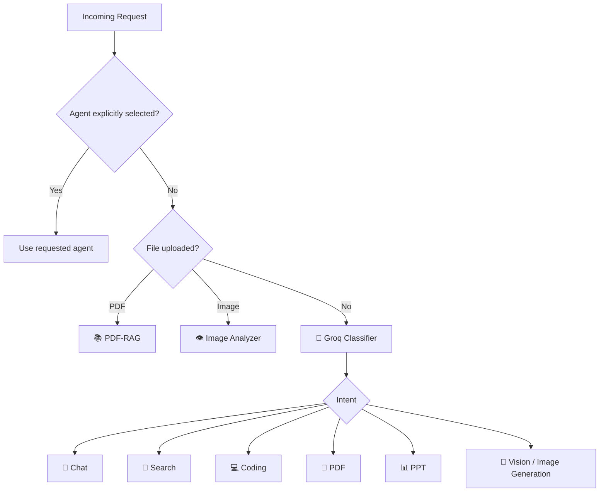
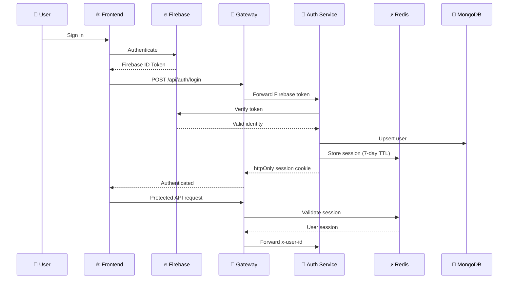
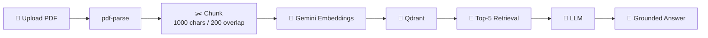
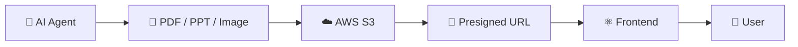

# ⚡ AxioraAI

> **A production-style, full-stack multi-agent AI assistant powered by LangGraph, microservices, and modern cloud infrastructure.**

[](https://nodejs.org/)
[](https://react.dev/)
[](https://expressjs.com/)
[](https://langchain-ai.github.io/langgraph/)
[](https://www.docker.com/)
[](https://www.mongodb.com/)
[](https://redis.io/)
[](https://aws.amazon.com/ecs/)
[](https://aws.amazon.com/ecr/)
[](https://aws.amazon.com/cloudfront/)
[](https://github.com/features/actions)
[](https://opensource.org/licenses/MIT)

---

## ✨ What is AxioraAI?

**AxioraAI** is a full-stack, ChatGPT-like AI platform built around a **⚙️ true microservices backend** and a **LangGraph multi-agent system** — every service (Gateway, Auth, Chat, Billing, Agent) is an independently deployable unit with its own container, its own scaling behavior, and its own lifecycle, rather than a single monolithic API.

Instead of sending every prompt to the same model, AxioraAI intelligently routes each request to a specialized agent:

```text
💬 Chat       🔎 Web Search       💻 Coding
📄 PDF        📊 PowerPoint       📚 PDF-RAG
👁️ Vision     🎨 Image Generation
```

It also includes:

- 🔐 Firebase authentication + Redis-backed sessions
- 💳 Razorpay subscriptions and credit-based usage
- 🧠 Redis conversation memory
- 📚 Qdrant-powered PDF RAG
- ☁️ AWS S3 artifact storage
- 🐳 Dockerized backend services
- ⚡ React + Redux frontend
- 🛡️ Gateway-based authentication and service routing
- ⚙️ **Microservices deployed independently on AWS ECS (Fargate)**
- 📦 Docker images built and pushed to **AWS ECR**
- 🌐 **Application Load Balancer** fronting the ECS services, exposing a live backend URL
- ☁️ Frontend served globally through **AWS CloudFront**
- 🔁 **CI/CD pipeline** automating build → push → deploy on every release

> **The goal:** demonstrate how a real AI SaaS product can be designed *and shipped* beyond a single chatbot endpoint — from local development all the way to a live, load-balanced, microservices deployment on AWS.

---

## 🎯 Core Features

| Feature | What it does |
|---|---|
| 🤖 **Multi-Agent Routing** | LangGraph decides which specialized agent should process a request |
| 💬 **AI Chat** | General conversation with Redis-backed recent-message memory |
| 🔎 **Web Search** | Tavily retrieves live web information before the chat agent composes the answer |
| 💻 **Code Generation** | Generates/reviews/debugs code and can return structured project artifacts |
| 📄 **PDF Generation** | Generates real PDF documents and stores them in S3 |
| 📊 **PPT Generation** | Generates PowerPoint decks using `pptxgenjs` |
| 📚 **PDF-RAG** | Upload a PDF, embed it into Qdrant, and ask grounded questions |
| 👁️ **Image Analysis** | Gemini multimodal vision for OCR, charts, tables and image Q&A |
| 🎨 **AI Image Generation** | Prompt engineering + Pollinations AI + S3 |
| 🔐 **Authentication** | Firebase login with Redis session cookies |
| 💳 **Billing** | Razorpay plans with credit-based usage |
| 📦 **Artifacts** | Monaco-powered viewer for generated code artifacts |
| ☁️ **Cloud Storage** | Presigned S3 URLs for generated files |

---

# 🏗️ Architecture

The application follows a **gateway → microservices → AI/data infrastructure** architecture.



### 🔄 Request lifecycle



---

# ☁️ Cloud Deployment Architecture (AWS)

AxioraAI isn't just designed as microservices — it is **deployed** as microservices. Each backend service is containerized, pushed to a private registry, and run as its own independently scalable service behind a load balancer, while the frontend is distributed globally through a CDN.

> ⚙️ **Highlight — Microservices in production:** the Gateway, Auth, Chat, Billing and Agent services each ship as a **separate Docker image → separate ECR repository → separate ECS service**, so any one service can be redeployed, scaled, or rolled back without touching the others.

### 🔄 Deployment pipeline



### 🧭 What actually happens, step by step

| Stage | Action | Service |
|---|---|---|
| 1️⃣ | Code is pushed and the **CI/CD pipeline** triggers automatically | GitHub Actions / pipeline |
| 2️⃣ | Each microservice is **built into its own Docker image** | Gateway • Auth • Chat • Billing • Agent |
| 3️⃣ | Images are **pushed to Amazon ECR** (one repository per service) | 📦 AWS ECR |
| 4️⃣ | **Amazon ECS** pulls the latest images and runs each service as an independent task/service | 🧩 AWS ECS |
| 5️⃣ | An **Application Load Balancer** sits in front of the ECS services and exposes a single, stable **backend URL** | ⚖️ AWS ALB |
| 6️⃣ | The **React frontend build** is deployed and served through **CloudFront**, giving low-latency global delivery | ☁️ AWS CloudFront |
| 7️⃣ | The frontend on CloudFront talks to the backend URL behind the ALB, completing the request loop | 🔁 End-to-end |

### 🏆 Why this matters

- 🧩 **True service isolation** — every microservice has its own image, its own ECS service, and can scale or fail independently.
- ⚖️ **Load-balanced backend** — the ALB distributes traffic across running tasks and gives a single stable entry point for the API.
- 🌐 **Global, fast frontend** — CloudFront caches and serves the frontend close to the user, decoupled entirely from backend deployment.
- 🔁 **Automated releases** — the CI/CD pipeline removes manual build/push/deploy steps, so shipping a change is a `git push`, not a checklist.

---

# 🧠 The Multi-Agent Brain

The core differentiator is the **LangGraph `StateGraph`** inside:

```text
Backend/services/agent
```

The shared state is:

```js
{
  prompt,
  aiResponse,
  agent,
  conversationId,
  searchResults,
  images,
  artifacts,
  userId,
  file
}
```

The high-level graph is:



### 🎯 Router decision process



### 🤖 Agent matrix

| Agent | Responsibility | Main Technology | Output |
|---|---|---|---|
| 💬 **Chat** | General conversation + memory | Groq | Markdown / text |
| 🔎 **Search** | Web search + answer composition | Tavily + Groq | Search-backed answer |
| 💻 **Coding** | Generate/review/debug/optimize code | OpenRouter / DeepSeek | Code artifact / Markdown |
| 📄 **PDF** | Generate downloadable PDF | LLM + pdfkit + S3 | PDF URL |
| 📊 **PPT** | Generate 6-slide presentation | LLM + pptxgenjs + S3 | PPTX URL |
| 📚 **PDF-RAG** | Ask questions over uploaded PDFs | Gemini + Qdrant | Grounded answer |
| 👁️ **Image Analyzer** | Analyze uploaded images | Gemini Vision | Markdown analysis |
| 🎨 **Vision / Image Gen** | Generate images from prompts | LLM + Pollinations + S3 | Image URL |

---

# 🔐 Authentication Flow

AxioraAI uses **Firebase Authentication** for identity and **Redis sessions** for application-level authentication.



---

# 💳 Billing & Credit System

AxioraAI uses **Razorpay** with usage-based credits.

### Plans

| Plan | Price | Credits | Validity |
|---|---:|---:|---:|
| 🆓 Free | ₹0 | 100 | 30 days |
| 🚀 Starter | ₹199 | 500 | 30 days |
| ⭐ Pro | ₹499 | 1000 | 30 days |

### Credit costs

| Operation | Credits |
|---|---:|
| 💬 Chat | 1 |
| 🔎 Search | 5 |
| 💻 Coding | 10 |
| 📄 PDF | 10 |
| 📊 PPT | 10 |
| 🎨 Vision / Image | 10 |

### Payment flow

```mermaid
flowchart LR
    A["👤 User"] --> B["⚛️ Frontend"]
    B --> C["💳 create-order"]
    C --> D["Razorpay"]
    D --> E["💰 Payment"]
    E --> F["verify-payment"]
    F --> G["HMAC-SHA256 Verification"]
    G --> H["🔐 Auth Service"]
    H --> I["Update Plan + Credits"]
    I --> J["⚡ Refresh Redis Session"]
```



---

# 📚 PDF-RAG Pipeline

PDF chat uses a dedicated retrieval pipeline:



Each uploaded PDF receives an isolated Qdrant collection:

```text
pdf-<timestamp>
```

This keeps uploaded documents separated and avoids cross-document retrieval.

---

# ☁️ Artifact Storage

Generated files are uploaded to **AWS S3** instead of being kept permanently inside the application.



Benefits:

- ☁️ External object storage
- 🔒 Expiring access URLs
- 📦 Reduced application-server storage
- ⚡ Direct user downloads

---

# 💻 Code Artifact System

The coding agent can return structured project files:

```js
{
  files: [
    {
      name: "index.html",
      content: "..."
    },
    {
      name: "style.css",
      content: "..."
    },
    {
      name: "script.js",
      content: "..."
    }
  ]
}
```

The frontend renders these through a **Monaco-based Artifact Viewer**, providing a development-environment-like experience.

```text
┌───────────────────────────────────────────────┐
│ 📁 Artifact                                  │
├───────────────┬───────────────────────────────┤
│ index.html    │                               │
│ style.css     │   📝 Monaco Editor            │
│ script.js     │                               │
│               │   Generated code              │
└───────────────┴───────────────────────────────┘
```

---

# 🧱 Repository Structure

```text
AI/
│
├── Backend/
│   ├── docker-compose.yml
│   ├── package.json
│   │
│   ├── shared/
│   │   └── redis/
│   │       └── redis.js
│   │
│   ├── gateway/
│   │   ├── index.js
│   │   ├── controllers/
│   │   ├── middleware/
│   │   ├── utils/
│   │   └── Dockerfile
│   │
│   └── services/
│       │
│       ├── auth/
│       │   ├── controllers/
│       │   ├── models/
│       │   ├── config/
│       │   └── routes/
│       │
│       ├── chat/
│       │   ├── controllers/
│       │   ├── models/
│       │   └── routes/
│       │
│       ├── billing/
│       │   ├── controllers/
│       │   ├── config/
│       │   ├── models/
│       │   └── routes/
│       │
│       └── agent/
│           ├── graph/
│           ├── agents/
│           ├── config/
│           ├── utils/
│           ├── controllers/
│           └── Dockerfile
│
└── Frontend/
    └── vite-project/
        ├── src/
        │   ├── App.jsx
        │   ├── pages/
        │   ├── components/
        │   ├── features/
        │   ├── redux/
        │   └── utils/
        └── vite.config.*
```

---

# 🛠️ Tech Stack

### Frontend

| Technology | Purpose |
|---|---|
| ⚛️ React 19 | UI |
| ⚡ Vite | Development/build |
| 🎨 Tailwind CSS | Styling |
| 🧠 Redux Toolkit | State management |
| 🔥 Firebase SDK | Authentication |
| 📝 Monaco Editor | Code artifacts |
| 📜 React Markdown | AI responses |
| 🎞️ Motion | UI animations |
| 🌐 Axios | HTTP requests |

### Backend

| Technology | Purpose |
|---|---|
| 🟢 Node.js | Runtime |
| 🚂 Express 5 | API services |
| 🐳 Docker | Containerization |
| 🚪 API Gateway | Service routing |
| 🍃 MongoDB + Mongoose | Persistent data |
| ⚡ Redis + ioredis | Sessions + memory |
| 🔷 Qdrant | Vector database |
| 🧠 LangChain | LLM tooling |
| 🕸️ LangGraph | Agent orchestration |

### AI & Cloud

| Technology | Purpose |
|---|---|
| 🤖 Groq | Chat / routing / search |
| ✨ Google Gemini | Vision + embeddings |
| 🧠 OpenRouter / DeepSeek | Coding |
| 🔎 Tavily | Web search |
| 🎨 Pollinations AI | Image generation |
| ☁️ AWS S3 | Artifact storage |
| 💳 Razorpay | Payments |
| 🔥 Firebase | Authentication |

---

# 🌳 Data Model

### User

```text
firebaseUid
name
email
avatar
plan
credits
totalCredits
planExpiresAt
```

### Conversation

```text
title
userId
timestamps
```

### Message

```text
conversationId
role
content
images[]
artifacts[]
```

### Payment

```text
userId
orderId
amount
credits
plan
currency
status
paymentId
```

---

# 🌐 API Reference

All API requests are routed through the gateway.

> Protected routes require a valid `session` cookie.

| Method | Route | Service | Description |
|---|---|---|---|
| `POST` | `/api/auth/login` | Auth | Verify Firebase token + create session |
| `POST` | `/api/auth/logout` | Auth | Destroy session |
| `GET` | `/api/me` | Gateway | Get current authenticated user |
| `POST` | `/api/chat/create-conversation` | Chat | Create conversation |
| `GET` | `/api/chat/conversations` | Chat | List conversations |
| `PATCH` | `/api/chat/update-conversation` | Chat | Rename conversation |
| `POST` | `/api/chat/save-message` | Chat | Persist message |
| `GET` | `/api/chat/messages/:conversationId` | Chat | Get conversation messages |
| `POST` | `/api/agent` | Agent | Run LangGraph AI pipeline |
| `POST` | `/api/billing/create-order` | Billing | Create Razorpay order |
| `POST` | `/api/billing/verify-payment` | Billing | Verify payment + upgrade plan |

> ⚠️ **Before publishing:** verify exact API paths against the current `routes/*.js` files.

---


Firebase client configuration should be supplied through `.env`.

---

# 🚀 Getting Started

## 1. Clone the repository

```bash
git clone <your-repository-url>
cd AI
```

## 2. Start Redis

From the backend directory:

```bash
cd Backend
docker-compose up -d
```

## 3. Configure infrastructure

Set up:

- MongoDB Atlas or local MongoDB
- Qdrant
- AWS S3 bucket
- Firebase project
- Razorpay test credentials
- Required AI provider API keys

## 4. Start backend services

Run each service independently:

```bash
cd gateway
npm install
npm run dev
```

```bash
cd services/auth
npm install
npm run dev
```

```bash
cd services/chat
npm install
npm run dev
```

```bash
cd services/billing
npm install
npm run dev
```

```bash
cd services/agent
npm install
npm run dev
```

## 5. Start frontend

```bash
cd Frontend/vite-project
npm install
npm run dev
```

The Vite development server normally runs at:

```text
http://localhost:5173
```

---

# 🐳 Docker

Each backend service has its own `Dockerfile`.

The current `docker-compose.yml` is used to start **Redis**.

A future improvement would be to extend Compose to include:

```text
Gateway
Auth
Chat
Billing
Agent
Redis
MongoDB
```

for a single-command local environment.

---

# ⚡ Performance & Reliability

Several implementation details are designed to prevent unnecessary latency and resource usage.

### 🧠 Redis conversation memory

Recent conversation messages are cached per conversation:

```text
Conversation
      │
      ▼
Redis: messages-<conversationId>
      │
      ├── Cache hit → last 20 messages
      │
      └── Cache miss → Chat Service → MongoDB
```

### ⏱️ Timeout guards

The system includes timeout protection:

| Component | Timeout |
|---|---:|
| Router | 15s |
| General agents | 20s |
| Coding agent | 60s |

This prevents requests from hanging indefinitely.

---

# 🔒 Security & Cost-Conscious Design

AxioraAI uses several mechanisms to keep the system controlled:

- 🔐 Firebase identity verification
- 🍪 `httpOnly` session cookie
- ⚡ Redis session TTL
- 🪪 Internal `x-user-id` propagation
- 💳 Credit-based AI usage
- ☁️ Expiring S3 presigned URLs
- 📦 Generated artifacts stored outside the application server
- 📚 Isolated Qdrant collection per uploaded PDF
- ⏱️ Agent timeout guards

> Before making the repository public, rotate any credentials that may have been exposed and ensure `.env` and `serviceAccountKey.json` are ignored by Git.

---

```text
Prompt → Router → Agent → Response → Artifact
```

would provide more visual impact than many static screenshots.

---

# 🗺️ Roadmap

- [x] Production deployment on AWS (ECR + ECS + ALB)
- [x] Frontend delivery via CloudFront
- [x] CI/CD pipeline for automated build & deploy
- [ ] Full Docker Compose environment for local dev
- [ ] Automated service health checks
- [ ] Centralized logging
- [ ] Distributed tracing
- [ ] More specialized AI agents
- [ ] Improved artifact preview
- [ ] Production monitoring
- [ ] Automated API documentation

---

# ⭐ Why This Project Stands Out

AxioraAI demonstrates more than simply calling an LLM API.

It combines:

```text
                 ┌──────────────────────┐
                 │       AxioraAI       │
                 └──────────┬───────────┘
                            │
          ┌─────────────────┼─────────────────┐
          ▼                 ▼                 ▼
     🧠 AI Systems      🏗️ Backend        ☁️ Cloud
          │                 │                 │
      LangGraph         Microservices       AWS S3
      Multi-Agent       API Gateway         Docker
      RAG               MongoDB             Redis
      Vision            Redis               Qdrant
          │                 │                 │
          └─────────────────┼─────────────────┘
                            ▼
                    💳 Production SaaS
                    Firebase + Razorpay
```

The project therefore showcases:

**AI Engineering + Backend Engineering + Distributed Systems + Cloud + SaaS Architecture**

---

# 📌 Implementation Highlights

- **Conversation memory:** Redis caches the latest 20 messages per conversation and falls back to MongoDB on cache miss.
- **Artifact storage:** PDFs, PPTs and generated images are uploaded to S3 and exposed through expiring presigned URLs.
- **Code artifacts:** the coding agent returns structured files that the frontend renders with Monaco Editor.
- **Search composition:** the search agent retrieves Tavily results and passes state to the chat agent for final answer generation.
- **PDF-RAG isolation:** every uploaded PDF gets its own Qdrant collection.
- **Timeout protection:** router and agent operations are guarded against long-running requests.

---

## 👨‍💻 Project Structure at a Glance

```text
                 ┌───────────────┐
                 │  React Client │
                 └───────┬───────┘
                         │
                         ▼
                 ┌───────────────┐
                 │ API Gateway   │
                 └───────┬───────┘
                         │
       ┌─────────────────┼─────────────────┐
       ▼                 ▼                 ▼
  🔐 Auth            💬 Chat           💳 Billing
       │                 │                 │
       └─────────────────┼─────────────────┘
                         ▼
                 ┌───────────────┐
                 │ 🧠 LangGraph │
                 └───────┬───────┘
                         │
       ┌─────────┬───────┼───────┬─────────┐
       ▼         ▼       ▼       ▼         ▼
     Chat     Search   Coding    RAG     Vision
                         │
                    PDF / PPT / Image
                         │
                         ▼
                      ☁️ S3
```

---
